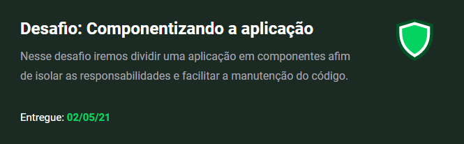

<h1 align="center">
  watch me
</h1>

Desafio 02 - Componetizando a aplicação

## Desafio proposto

> O seu principal objetivo é uma pequena aplicação de atividades a fazer, para treinar um pouco mais sobre manipulação do estado no React.

## 👨‍🎓 Nota
